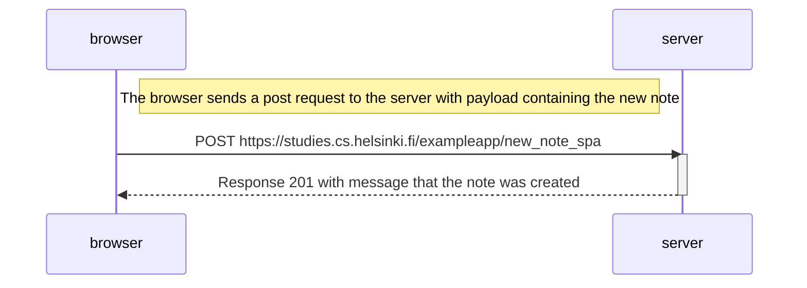

```mermaid
sequenceDiagram
    participant browser
    participant server

    Note right of browser: The browser sends a post request to the server with payload containing the new note
    browser->>server: POST https://studies.cs.helsinki.fi/exampleapp/new_note_spa
    activate server
    server-->>browser: Response 201 with message that the note was created
    deactivate server
```